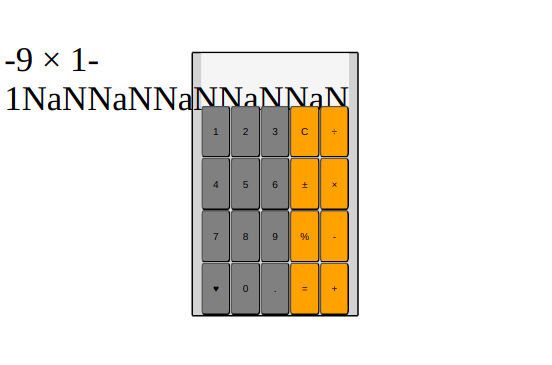

# Calculator

The Odin Project's Foundation Course final project.
JavaScript, problem solving. Basic styling.

# TODO

- [x] Do the TODO list
- [x] Basic operations
  - [x] add
  - [x] subtract
  - [x] multiply
  - [x] divide
- [x] Set up numbers and operators
- [x] Basic HTML calculator with buttons (non functional)
- [x] Display
- [x] Set up button logic to update main variables
- [x] Utils buttons work and calculate properly
- [x] Function to populate display

## Extra

- [x] Decimal point
- [x] Backspace button
- [x] Keyboard support

## Personal Extra
- [ ] Style
- [ ] Phone responsive

## Bug fixes / Small improvements

- [x] Calculator does not evaluate more than 2 numbers at the time
- [x] Round answers
- [x] Divide by 0 errors
- [x] Result behaviour with new operations
- [ ] Typing multiple zeroes behaviour is weird
- [ ] After pressing `=`, pressing a number resets the state
- [x] After pressing `=`, pressing an operator reuses the result
- [ ] Clean operator logic. Avoid hard values
- [x] Clean `setNumber` function. Make it readable

# Planning

Numbers and operator may be set with a function. Useful for checking erros and status.

Not much planning was done since.

The plan is to improve this part on future projects.

# Insights

The current logic envolving operators and utils does not seem right. Hard values in the current way. \
I want to find a better way to deal with this. \
This would be more readable and less error prone with some constants declared at the beggining.

Wow I really wish I had unit tests here. Would make it all way easier.

The `setNumber` function is really bothering me too. Want to improve it later. \
This was handled finally. Separeted it's logic in smaller functions, it seems more readable.

Favorite development bug: \

